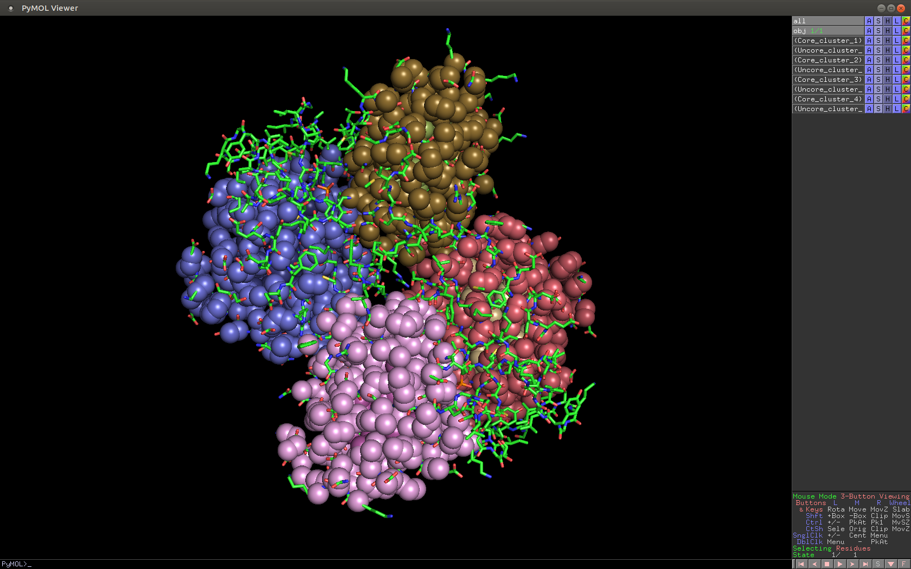

Hydrocluster - Bioimformatics Tool
==================================

Short description
-----------------
The program Hydrocluster is designed to determine the position, size and content of hydrophobic,
hydrophilic and charged clusters in protein molecules. The program is based on the DBSCAN algorithm.

**Keywords:** molecular modeling, bioinformatic, protein structure,
hydrophobic core, hydrophobic cluster, DBSCAN

Installation
------------

```shell
pip install --upgrade hydrocluster
```
(or pip3 in distributive with default python 2 version)

User Interface
--------------

### Command line

The program is called with the command ’hydrocluster’ and following
parameters:
```shell
hydrocluster [-h][-i INPUT][-emin EMIN][-emax EMAX][-es ESTEP]
[-smin SMIN][-smax SMAX][-g {tkgui,cli,testlist}][-o OUTPUT][-c CHAINS]
[-rl RESLIST][-pt{hydropathy,menv,fuzzyoildrop,nanodroplet,aliphatic_core,hydrophilic,positive,negative}]
[-pH PH][-sc {si_score,calinski,dbcv}][-nf][-na][-eps EPS][-min_samples MIN_SAMPLES]
```
#### Arguments:

**-h, --help**  
show help message and exit

**-i INPUT, --input INPUT**  
Input file name (pdb, txt, cif, ent) - pdb file name, cif file name,
idpdb or list of ispdbs

**-emin EMIN, --emin EMIN**  
Minimum EPS value (Å). Default=3.0

**-emax EMAX, --emax EMAX**  
Maximum EPS value (Å). Default=15.0

**-es ESTEP, --estep ESTEP**  
Step of EPS (Å). Default=0.1

**-smin SMIN, --smin SMIN**  
Minimum MIN SAMPLES. Default=3

**-smax SMAX, --smax SMAX**  
Maximum MIN SAMPLES. Default=50

**-g {tkgui,cli,testlist}, --gui**  
UI modes. Default=’tkgui’ (tkgui - graphic interface, cli - command
line, testlist - using testlist module for data processing (see -i
filename.txt and -o filename of data base).

**-o OUTPUT, --output OUTPUT**  
Output directory name/file name or db name

**-c CHAINS, --chains CHAINS**  
Selected chains. Default=None

**-rl RESLIST, --reslist RESLIST**  
Selected amino acid residues. Default=None

**-pt{hydropathy,menv,fuzzyoildrop,nanodroplet,aliphatic\_core,hydrophilic,positive,negative}, --ptable**  
Property table for weighting. Default=’hydropathy’

**-pH PH**  
pH value for calculatation of partial charges (positive or negative). Default=7.0

**-sc {si\_score,calinski,dbcv}, --score {si\_score,calinski,dbcv}**  
Score coefficient. Default=’calinski’

**-nf, --noise\_filter**  
Activate filter of noise for scoring function (**Not recommended!!!**).

**-na, --noauto**  
No automatic mode.

**-eps EPS**  
EPS value (Å). Default=3.0

**-min\_samples MIN\_SAMPLES**  
MIN SAMPLES value. Default=3

**At startup of hydrocluster without any parameters the program opens
with graphics interface.**

### Examples:
```shell
hydrocluster -i 1atg.pdb -g cli -o 1atg
```
Processing of file\_name.pdb by command line interface and file\_name
folder on return

File\_name folder consists of file\_name.py file for processing by
pymol, binary file (.dat) with saved session state, file\_name.log file
with saved log-data and two png files with pictures.

```shell
hydrocluster -g testlist -i defaultt.hjson
```

Reading of configuration file default.json and processing it by testlis. An example of a configuration file (with parameter comments) can be found at https://github.com/alashkov83/hydrocluster/blob/master/PDB_LISTS/default.hjson. Project\_name.db file and project\_name\_data folder consisting of tree structure with data files will be returned.

Graphical User Interface
------------------------

GUI was realized using Tkinter. It consists of a panel for selecting the
operation mode, a window for graphical representation of clustering
results Cluster analysis, and a window for displaying log file.


At the beginning of working with the graphical interface, it is
necessary to select the desired hydrophobicity/hydrophilicity table in
the sub-window of the mode selection window, select the method for
scoring of clustering in the metrics window and run on Manual (Manual mode -&gt;
Start) or automatic mode of operation (Auto mode -&gt; Start) in one of
the underlying windows. In the automatic mode, the optimal parameters
eps and min\_samples are selected by enumeration within the given
boundaries and with the given step. Upon completion of the work in the
automatic mode, when you click Options -&gt; Solution analysis -&gt; Autotune colormap, you can
get a graphical interpretation of the process of selecting the optimal
values namely dependencies min\_samples (eps) and min\_samples (eps³).
The point corresponding to the optimal parameters is marked in
color.


The Cluster analysis window presents a three-dimensional image of
clusters selected by the program in a protein molecule. Appropriate mtnu
sections allow you to make a coordinate grid in the image and get a brief comment
on the picture.

The Log window shows the numerical results of clustering, namely the
number of chains and clusters, the percentage of noise and the optimal
values of the hyperparameters (eps,min\_samples) and the metric used.
Further study of the macromolecule can be carried out using the PyMol
program (Options-&gt; OpenPyMol).



### Menu options:

**File-&gt;**

Open File - opens PDB or mmCIF file on a disk  
Open ID PDB - opens file from RSCB PDB data bank with ID PDB  
Load State - loads program state, saved in file  
Save PyMOL script - saves script (.py) for further processing with PyMOL  
Save State - saves the current state of program in file  
Save Picture - saves the clustering result in png format file  
Save LOG - saves log file of the current session  
Quit - quit from the program

**Options-&gt;**  
Select clustering solution -> By local max (min) - shows other solutions of cluster analysis by local extrema of scoring for make choice its  
Select clustering solution -> By max (min) values - shows other solutions of cluster analysis by values of scoring for make choice its  
Solution analysis -> Autotune colormap - shows graphs obtained as a result of clustering
parameters selection. Marked point corresponds optimal values of eps and min\_samples  
Solution analysis -> Autotune 3D-map - shows 3D-graph obtained as a result of clustering
parameters selection  
Solution analysis -> Scan by parameter - scans some values of clustering solutions by one of the parameter (eps or min\_samples) when second parameter are fixed  
Open PyMol - opens PyMol for further data display  
About Protein - displays information about protein  
Plot settings -> Plot grid - makes coordinate grid in the Cluster analysis window  
Plot settings -> Plot legend - displays the brief description of the picture    
Clear log - clears log information in the appropriate window  

**Help-&gt;**  
About - displays information about program, its license and version, and version of scikit-learn installed on the computer  
Readme - opens system web-browser and shows this paper 


Theory
------

Hydrophobic cores and hydrophobic clusters play an important role in the
folding of the protein, being the skeleton for functionally important
amino acid residues of enzyme proteins. In the cases of ligands of
amphiphilic nature, the hydrophobic clusters themselves are included in
the functionally important regions of the molecules. The interaction
with them should be taken into account, for example, when evaluating
molecular docking solutions. Hydrocluster programm is based on
ensity-Based Spatial Clustering of Applications with Noise (DBSCAN) \[1].
Atomic coordinates, their type and description of amino acid residues
(a. r.) and chemical groups \[2] are loaded from a file of the PDB, mmCIF formats, or directly from
the Protein Data Bank. For each a.r. (or chemical group) from the table of relative
hydrophobicity center of mass of non-H atoms is calculated. As weights
in the cluster analysis, various tables of a.r. \[3-7] (group \[2]) hydrophobicity known in
the literature are used (see Table1 or Table2). Separately, for clustering
electrically charged amino acid residues, the function of calculating
weighting coefficients as modules of partial charges of side groups
according to the formulas, which are derived from the
Henderson-Hasselbach equation, is implemented \[8]. As
hyperparameters DBSCAN uses the epsilon neighborhood radius (eps) and
the minimum number of neighbors (min\_samples). Eps is defined as the
maximum distance (in Angstrom (Å)) between the centers of mass of
hydrophobic a.r. (or chemical groups) which are adjacent in one cluster. The
min\_samples/eps³ ratio is proportional to the maximum distribution
density of the centers of mass of the hydrophobic a.r. (or chemical groups). 
Internal clustering validation measures (descibed in Table 3) 
are used as the quality criteria for cluster analysis. For
clusters of complex shape, it is better to use the silhouette
coefficient. At the same time, Calinski and Harabasz score, which uses
the distance between the element and the center of the cluster,
correctly estimates the areas of clusters with the highest density. This
areas are of interest from the point of view of the structural
organization of proteins. A feature of the DBSCAN algorithm is the
strong dependence of clustering results on the parameters - eps and
min\_samples. Hydrocluster implemented the selection of these parameters
by simply iterating over their values at user-defined boundaries,
followed by sorting the results according to the criterion of maximizing (minimizing)
the value of the corresponding estimated coefficient.

Table 1. Normalised (by Alanine) hydrophobic weights of amino acid residues
---------------------------------------------------------------------------

| a.r. | Hydropathy \[3] | Fuzzyoildrop \[4] | MENV \[5] | Nanodroplet \[6] | Aliphatic \[7] |
|------|-----------------|-------------------|-----------|------------------|----------------|
| ALA  | 1.0             | 1.0               | 1.0       | 1.0              | 1.0            |
| VAL  | 2.333           | 1.418             | 2.52      | 0.867            | 2.9            |
| LEU  | 2.111           | 1.369             | 2.64      | 0.904            | 3.9            |
| ILE  | 2.5             | 1.544             | 2.94      | 1.016            | 3.9            |
| PHE  | 1.556           | 1.583             | 2.58      | 0.963            | -              |
| TRP  | -               | 1.497             | 2.03      | 0.900            | -              |
| MET  | 1.056           | 1.448             | 1.64      | 0.799            | -              |
| CYS  | 1.389           | 1.748             | 3.48      | 0.588            | -              |
| THR  | -               | 0.538             | 1.82      | 0.424            | -              |
| SER  | -               | -                 | -         | 0.372            | -              |
| GLY  | -               | -                 | -         | 0.477            | -              |

Table 2. Hydrophobic weights of chemical (Rekker's) groups \[2]
-------------------------------------------------------------

| Chemical radical | Hydrophobic weight |
|------------------|--------------------|
| C₆H₅ (phenyl)    | 1.903              |
| CH               | 0.315              |
| CH₂              | 0.519              |
| CH₃              | 0.724              |
| Indolyl          | 1.903              |

Table 3. Internal clustering validation measures
------------------------------------------------

| Scoring function        | Range of values | Optimal value | Realisation  | Paper     |
|-------------------------|-----------------|---------------|--------------|-----------|
| Calinski-Harabasz score | 0 ->            | maximum       | scikit-learn | \[9]      |
| Silhouette score        | -1 ... 1        | maximum       | scikit-learn | \[10]     |
| S_Dbw                   | 0 ->            | minimum       | internal     | \[11, 12] |
|                         |                 |               |              |           |

Requirements
------------

* Python 3.4 or higher (CPython only support)
* psutil
* progressbar2
* matplotlib>=1.5.1
* numpy>=1.14.2
* scikit_learn>=0.19.1
* biopython>=1.71
* mmtf-python>=1.1.0
* msgpack>=0.5.6

To easily browse through db files you will need a DB Browser for SQLite
(<https://sqlitebrowser.org>). It is recommended to install Pymol
molecular viewer (version: 1.7+).

**For MS Windows:** Use Anaconda (<https://anaconda.org>) for Windows -
it includes majority of the dependencies required. But mmtf-python and
msgpack not available on Anaconda - need to use pip. Define environment
variable PYTHONIOENCODING to UTF-8. For correct display of the Angstrom
symbol use console fonts including this symbol (for example, SimSun font
family).


References
----------
1. Ester, M., H. P. Kriegel, J. Sander, and X. Xu, In: Proceedings of the 2nd International Conference on Knowledge Discovery and Data Mining, Portland, OR, AAAI Press,226-231. 1996
2. R. Mannhold, R. F. Rekker Perspectives in Drug Discovery and Design, 18: 1–18, 2000.
3. J. Kyte, R. F. Doolittle. J Mol Biol. 1982. 157, 105-132.
4. Brylinski M, Konieczny L, Roterman I. Int J Bioinform Res Appl. 2007;3(2):234-60.
5. D. Bandyopadhyay .E. L. Mehler.Proteins 2008.72.646-659
6. Zhu C. Q., Gao Y. R. , Li H. et.al.// Proc. NAS. 2016.113.12946.
7. Ikai, A.J. 1980. J. Biochem. 88, 1895-1898.
8. Dexter S. Moore BIOCHEMICAL EDUCATION 13(1) 1985.
9. Calinski T., Harabasz J. // Communications in Statistics. 1974. 3 . 1.
10. Rousseeuw P. Comput. Appl. Math. 1987. 20. 53.
11. M. Halkidi and M. Vazirgiannis, in ICDM, Washington, DC, USA, 2001, pp. 187–194.
12. Tong, J. & Tan, H. J. Electron.(China) (2009) 26: 258. https://doi.org/10.1007/s11767-007-0151-8
